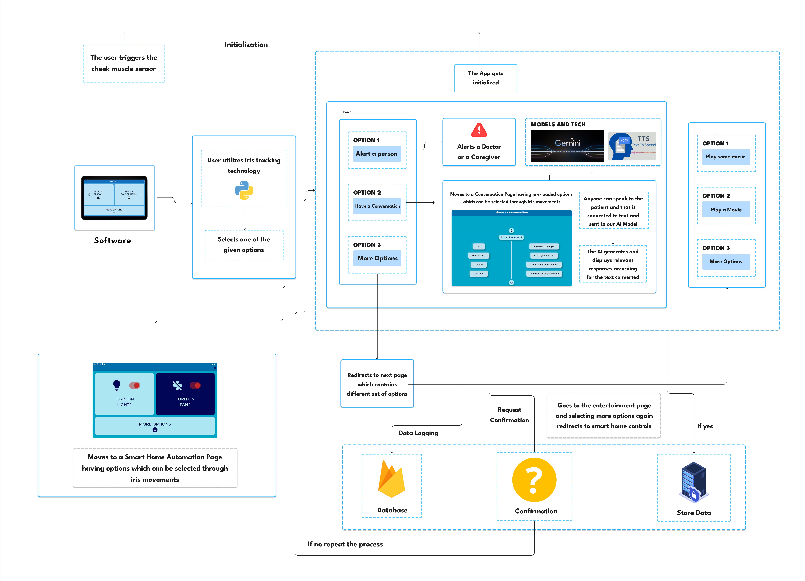

# EyeTalk - An Iris enabled ALS Assistant
Our app is an Assistive Technology application which is primarily focused on aiding ALS patients. Amyotrophic Lateral Sclerosis is a Neuro degenerative disease which leaves the patient completely paralyzed. Everything including their mouth, torso and limbs are paralyzed. The only parts of their body they can move are their eyes and cheek muscles. To combat this, the primary feature of the app is the communication feature which uses Google Gemini in an innovative way. When someone talks to the user the app records their voice. This recording of what they say is used by Gemini to generate appropriate responses. The users can then use simple eye movements to choose any one of the provided responses. This enables them to communicate and express their feelings even if they are completely paralyzed and can't speak. To provide the user with more independence the secondary feature of the app is Smart Home Automation, where the user can control smart home appliances like fans, lights etc, independently. The app also prioritizes safety by offering an alert feature which enables the user to alert either their caretaker or their doctor when there is an emergency. Future enhancements include entertainment features to for the users, but most importantly, integration with infrared camera to increase eye tracking accuracy in low light conditions.

## Features

- **Iris Tracking**: Allows users to coomunicate with others through our app which can be controlled using eye movements, providing a hands-free experience.
- **Smart Home Automation**: Seamlessly integrates with smart home systems, allowing users to control various devices with ease.
- **Gemini Response Generation**: Generates responses according to the care-givers or friends's spoken words and the user can choose between them using their eye movements.

## Architecture Diagram
  

## Technologies Used
- *Frontend*: Flutter for building the user friendly interfaces. 
- *Backend*: Python for iris tracking.
- *Database*: Firebase for iris tracking connectivity.

---

---

**Team:**
| Name      | GitHub Username |
| -------------- | --------------- |
| Vishaal Krishna    | @Vishaal19fl    |
| Vishaal S    | @Vishaal-Sathya    |
| Sharvesh  A R   | @Shxrvxshar7     |
| Surya Prakash G  | @PureVodka007 |

